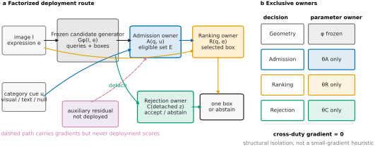

# ARROW

> **Current research manuscript:** [Confidence for Which Prediction?](paper/empirical_study_v8.pdf)
> — supervision coverage shapes grounding reliability.
> [Paper/build entrypoint](paper/README.md) ·
> [v7 revision](docs/evidence_v7_revision_20260906.md) ·
> [Coverage experiment and seed-explicit Figure 1](docs/confidence_coverage_v1_20260906.md) ·
> [Completed coverage results and v8 story](docs/coverage_v8_results_and_story_20260906.md) ·
> [v6 results](docs/readout_v6_final_results_20260906.md) ·
> [Record-only reproduction](docs/readout_v6_reproduction.md) ·
> [Readiness and remaining limitations](docs/empirical_submission_readiness_20260905.md).
>
> The sealed ARROW-U2 method and its experimental lineage below are retained.
> They are not evidence that hard isolation universally improves accuracy.

The v8 manuscript integrates the completed 12-head coverage intervention and
three paired image-cluster analyses. At fixed localization and training budget,
broader positive supervision reduces correct-output-head risk but increases
existence-head risk. Three-state comparisons explain which ranking abilities
improve and which deteriorate; frozen transfer tests this response. Readout
controls, explicit seed variation and fixed score combinations support this
single argument. Historical drafts, model weights and experimental evidence
remain preserved, and FineCops Test has not been reopened.

## Historical method implementation

**Responsibility-Isolated Admission, Ranking, and Abstention for Visual
Grounding**

ARROW expands to **Admission, Ranking, and Rejection with Ownership-Separated
Weights for Reliable Visual Grounding**. The line above is the earlier method
paper subtitle; the expansion is retained by the release manifest and public
artifact ABI.

ARROW separates three decisions that a grounding model should not force into
one score: which candidates are category-compatible, which compatible instance
best matches the full expression, and whether any prediction should be emitted.

> **Sealed historical method model:** `ARROW-U2`
>
> **Sealed method implementation:** `U2-v5`
>
> **Repository lineage:** `PIVOT` (legacy implementation and schema namespace)

<p align="center">
  
</p>

## Historical method model

`ARROW-U2` names the complete historical method model:

```text
full expression + image
        │
        ▼
frozen B58 candidate generator ──► queries + boxes
        │
        ├── category cue ──► Admission ──► eligible queries
        │                                  │
        ├── full expression ──► frozen R100 Ranking ──► selected box
        │
        └── detached statistics ──► isolated D3 Abstention ──► emit / abstain
```

The primary `ARROW-U2` interface uses one visual category exemplar. Canonical
text and category-agnostic null cues are controlled Admission-input variants,
not separate paper models.

| Public term | Meaning | Repository identifier |
| --- | --- | --- |
| **ARROW** | Project and historical method | Public name |
| **ARROW-U2** | Complete sealed historical method model | `U2-v5 A / A5+C3` |
| **ARROW-V** | Visual-support Admission interface | support-patch route |
| **ARROW-T** | Canonical-text Admission control | text-cue route |
| **ARROW-N** | Category-agnostic mechanism control | learned-null route |
| PIVOT | Repository and pre-ARROW implementation lineage | `pivot.*` schemas |

`Stage-A`, `Stage-B`, `V55/V56`, `routed-v3`, and bare `U2-v5` are historical
or reproduction-only identifiers. They are not alternative names for the
paper model. See the [ARROW-U2 model card](docs/arrow_u2_model_card.md) for the
complete ownership and naming contract.

## Historical method results

All results use sealed checkpoints and committed receipts. No external
benchmark was used to choose a checkpoint, Admission margin, or confidence
threshold.

| Evaluation | Frozen base | ARROW-U2 | Paired effect |
| --- | ---: | ---: | ---: |
| RefCOCO-family Test5 Acc@0.5 | 72.16 | **74.24** | +2.08 points, 95% CI [1.83, 2.35] |
| Strict-TN2031 FPR95 | 51.21 | **47.02** | 4.19-point reduction, 95% CI [2.46, 6.20] |
| gRefCOCO single/no-target AUROC | 68.95 | **71.75** | +2.80 points |
| gRefCOCO domain-derived FPR95 | 74.10 | **70.83** | -3.27 points |

On the fresh category-intervention panel, visual support, canonical text, and
the category-agnostic null cue obtain 48.24%, 32.29%, and 0.00%
bidirectional category-switch success. FineCops-Ref and gRefCOCO show that the
isolated rejector improves cross-benchmark ordering, while the internally
sealed operating threshold does not preserve 95% TPR.

## Public interfaces

### ARROW-V: visual category cue

Provide the full referring expression and one category support crop. The crop
only determines Admission; it never replaces the expression used for geometry
or within-set Ranking. This is the primary `ARROW-U2` interface.

### ARROW-T: canonical text cue

Provide the full expression plus an explicit canonical category phrase. This
is support-free but is not a raw image/expression-only interface. FineCops uses
the benchmark's structured target noun and reports that input difference.

`ARROW-N` is an ablation that measures whether a generic learned gate can mimic
category-conditioned Admission. It is not a recommended deployment interface.

## Paper and evidence

- [Paper package and build instructions](paper/README.md)
- [ARROW-U2 model card](docs/arrow_u2_model_card.md)
- [Admission-input protocol](docs/paper_cvpr_arrow_admission_input_protocol_20260818.md)
- [FineCops-Ref results](docs/paper_cvpr_arrow_finecops_results_20260819.md)
- [gRefCOCO rejection transfer](docs/arrow_grefcoco_rejection_transfer_20260820.md)
- [Historical implementation archive](docs/historical/README.md)

The manuscript build consumes committed registries, tables, and plot sources;
it does not need model weights or host-local `outputs/`:

```bash
python -m pip install -r paper/requirements.txt
make -C paper all
```

On the sealed experiment host, source hashes can additionally be checked with:

```bash
make -C paper verify-sources
```

## Experiment-host checkpoint replay

This command replays seed-42 `ARROW-U2` on RefCOCO validation. It is a
provenance replay for the sealed experiment host, not yet a clean-checkout
demo: checkpoints, datasets, and per-example records are not distributed in
Git.

```bash
export DATA_ROOT=/path/to/data
python tools/eval_text_groundingdino_refcoco_tn.py \
  --config config/ablations/cfg_arrow_admission_a_patch_eval_gap3.py \
  --ckpts outputs/u2v5_leakage_clean_anchor_20260817/formal/confidence_seed42_u50/checkpoint_iter.pth \
  --output_dir outputs/arrow_u2_quick_eval_seed42 \
  --data_root "$DATA_ROOT" --device cuda:0 --batch_size 16 --num_workers 4 \
  --seed 42 --amp --ref_splits refcoco_val --skip_tn --topk 1
```

Loaders fail closed on missing support or canonical inputs rather than silently
changing the route.

## Release contract

The byte-for-byte release-manifest copy is
[`paper/data/arrow_release_manifest.json`](paper/data/arrow_release_manifest.json)
(`arrow.release_manifest/v1`). It binds the immutable experiment-host paths,
checkpoint hashes, and legacy ABI.

| Seed | ARROW-U2 checkpoint SHA-256 |
| ---: | --- |
| 17 | `b8045f97d3fa4d21e95b49e6c4f50d12651775862d3a60ca479d51242665cf25` |
| 42 | `5746aedb1ccf6fbfdb22db66cbefa26ec874513451dabb05886fd5a2c950709c` |
| 73 | `90c05708e792248acffae27ca435e33ef86dea2e88518ed9fe501e72f064aef2` |

The manifest is an integrity contract, not a download index. A public release
must distribute the named bytes and verify these hashes before presenting the
replay command as externally reproducible.

## Repository map

```text
paper/                  CVPR manuscript, figures, tables, and source registry
config/ablations/       ARROW public configs plus legacy ABI-compatible configs
models/GroundingDINO/   detector and responsibility-isolated score owners
tools/                  training, evaluation, audit, and receipt builders
docs/                   current ARROW protocols and results
docs/historical/        pre-ARROW Stage-A/B and version-lineage navigation
```

Internal symbols such as `stage_b_u2v5_*`, `u2v5_*`, `pivot.*`, and historical
absolute paths remain unchanged because sealed checkpoints and receipts depend
on them. Public documentation must not present those identifiers as model
names.

## Citation

```bibtex
@inproceedings{arrow2027,
  title     = {ARROW: Responsibility-Isolated Admission, Ranking, and
               Rejection for Selective Visual Grounding},
  author    = {Anonymous},
  booktitle = {Proceedings of the IEEE/CVF Conference on Computer Vision and
               Pattern Recognition},
  year      = {2027}
}
```

ARROW builds on Grounding DINO and the retained third-party Open-GroundingDINO
implementation. We credit the
[Grounding DINO paper](https://arxiv.org/abs/2303.05499),
[IDEA-Research/GroundingDINO](https://github.com/IDEA-Research/GroundingDINO),
and [Open-GroundingDino](https://github.com/longzw1997/Open-GroundingDino).
