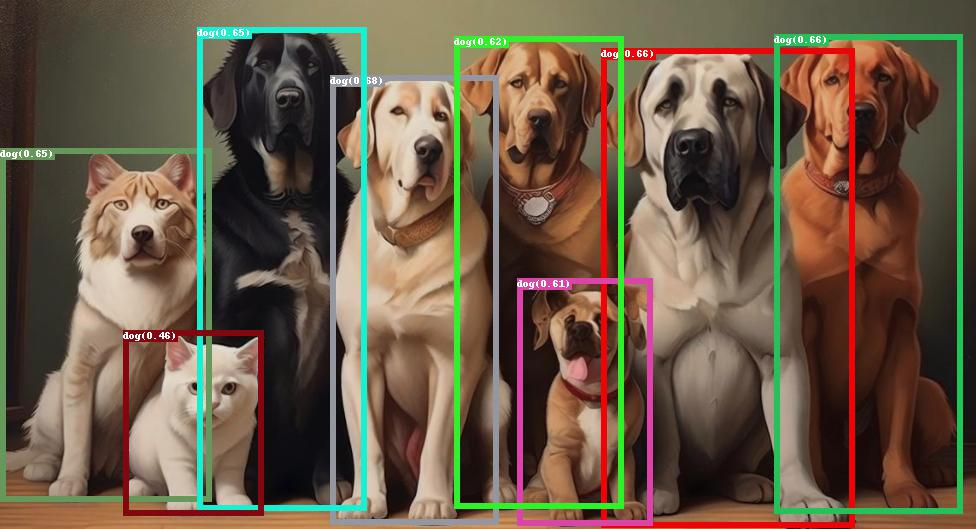
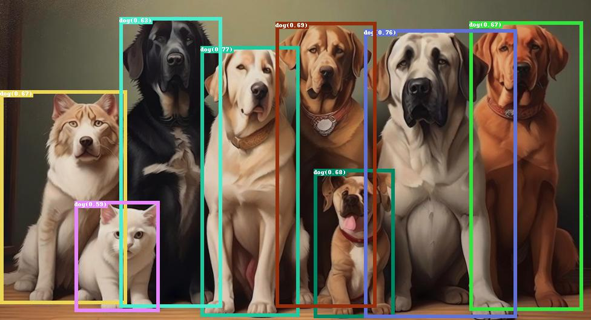
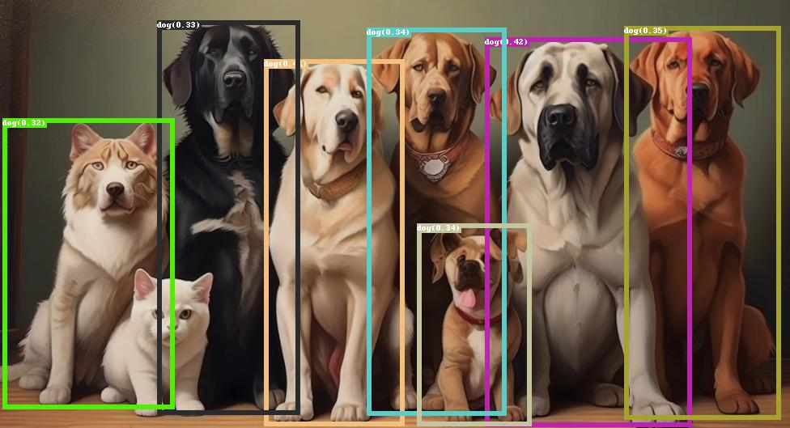
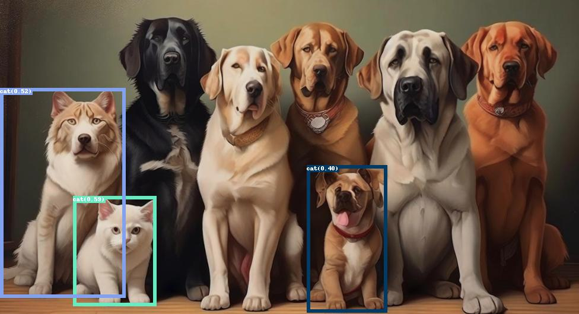
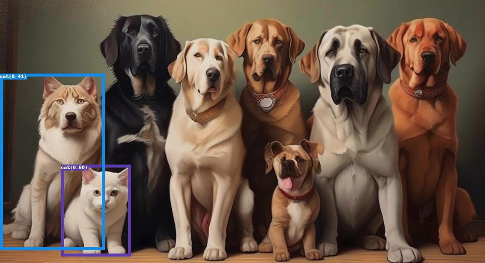
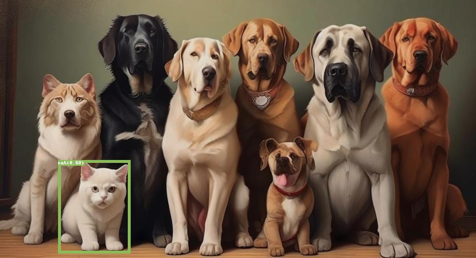

<div align="center">
  
</div>

This is the third party implementation of the paper **[Grounding DINO: Marrying DINO with Grounded Pre-Training for Open-Set Object Detection](https://arxiv.org/abs/2303.05499)** by [Zuwei Long]() and [Wei Li](https://github.com/bigballon).

**You can use this code to fine-tune a model on your own dataset, or start pretraining a model from scratch.**

- [Supported Features](#supported-features)
- [Setup](#setup)
- [Dataset](#dataset)
- [Config](#config)
- [Training](#training)
- [Patch Episode Training](#patch-episode-training)
- [Results and Models](#results-and-models)
- [Inference](#inference)
- [Acknowledgments](#acknowledgments)
- [Citation](#citation)
- [Contact](#contact)

# Supported Features

|                                | Official release version | The version we replicated |
| ------------------------------ | :----------------------: | :-----------------------: |
| Inference                      |         &#10004;         |         &#10004;          |
| Train (Object Detection data) |         &#10006;         |         &#10004;          |
| Train (Grounding data)         |         &#10006;         |         &#10004;          |
| Slurm multi-machine support    |         &#10006;         |         &#10004;          |
| Training acceleration strategy |         &#10006;         |         &#10004;          |
| Patch-only Stage A training    |         &#10006;         |         &#10004;          |
| Patch-only Stage B training    |         &#10006;         |         &#10004;          |


# Setup

We conduct our model testing using the following versions: Python 3.7.11, PyTorch 1.11.0, and CUDA 11.3. It is possible that other versions are also available.

1. Clone this repository.

```bash
git clone https://github.com/longzw1997/Open-GroundingDino.git && cd Open-GroundingDino/
```

2. Install the required dependencies.

```bash
pip install -r requirements.txt 
cd models/GroundingDINO/ops
python setup.py build install
python test.py
cd ../../..
```

3. Download [pre-trained model](https://github.com/IDEA-Research/GroundingDINO/releases) and [BERT](https://huggingface.co/bert-base-uncased) weights, then modify the corresponding paths in the train/test script.

# Dataset

For **training**, we use the [odvg data format](data_format.md) to support **both OD data and VG data**.  
Before model training begins, you need to convert your dataset into odvg format, see [data_format.md](data_format.md) | [datasets_mixed_odvg.json](config/datasets_mixed_odvg.json) | [coco2odvg.py](./tools/coco2odvg.py) | [grit2odvg](./tools/grit2odvg.py) for more details.  

For **testing**, we use [coco format](https://cocodataset.org/#format-data), which currently only supports OD datasets.

<details>
  <summary>mixed dataset</summary>
  </br>

``` json
{
  "train": [
    {
      "root": "path/V3Det/",
      "anno": "path/V3Det/annotations/v3det_2023_v1_all_odvg.jsonl",
      "label_map": "path/V3Det/annotations/v3det_label_map.json",
      "dataset_mode": "odvg"
    },
    {
      "root": "path/LVIS/train2017/",
      "anno": "path/LVIS/annotations/lvis_v1_train_odvg.jsonl",
      "label_map": "path/LVIS/annotations/lvis_v1_train_label_map.json",
      "dataset_mode": "odvg"
    },
    {
      "root": "path/Objects365/train/",
      "anno": "path/Objects365/objects365_train_odvg.json",
      "label_map": "path/Objects365/objects365_label_map.json",
      "dataset_mode": "odvg"
    },
    {
      "root": "path/coco_2017/train2017/",
      "anno": "path/coco_2017/annotations/coco2017_train_odvg.jsonl",
      "label_map": "path/coco_2017/annotations/coco2017_label_map.json",
      "dataset_mode": "odvg"
    },
    {
      "root": "path/GRIT-20M/data/",
      "anno": "path/GRIT-20M/anno/grit_odvg_620k.jsonl",
      "dataset_mode": "odvg"
    }, 
    {
      "root": "path/flickr30k/images/flickr30k_images/",
      "anno": "path/flickr30k/annotations/flickr30k_entities_odvg_158k.jsonl",
      "dataset_mode": "odvg"
    }
  ],
  "val": [
    {
      "root": "path/coco_2017/val2017",
      "anno": "config/instances_val2017.json",
      "label_map": null,
      "dataset_mode": "coco"
    }
  ]
}
```
</details>

<details>
  <summary>example for odvg dataset</summary>
  </br>

``` bash
# For OD
{"filename": "000000391895.jpg", "height": 360, "width": 640, "detection": {"instances": [{"bbox": [359.17, 146.17, 471.62, 359.74], "label": 3, "category": "motorcycle"}, {"bbox": [339.88, 22.16, 493.76, 322.89], "label": 0, "category": "person"}, {"bbox": [471.64, 172.82, 507.56, 220.92], "label": 0, "category": "person"}, {"bbox": [486.01, 183.31, 516.64, 218.29], "label": 1, "category": "bicycle"}]}}
{"filename": "000000522418.jpg", "height": 480, "width": 640, "detection": {"instances": [{"bbox": [382.48, 0.0, 639.28, 474.31], "label": 0, "category": "person"}, {"bbox": [234.06, 406.61, 454.0, 449.28], "label": 43, "category": "knife"}, {"bbox": [0.0, 316.04, 406.65, 473.53], "label": 55, "category": "cake"}, {"bbox": [305.45, 172.05, 362.81, 249.35], "label": 71, "category": "sink"}]}}

# For VG
{"filename": "014127544.jpg", "height": 400, "width": 600, "grounding": {"caption": "Homemade Raw Organic Cream Cheese for less than half the price of store bought! It's super easy and only takes 2 ingredients!", "regions": [{"bbox": [5.98, 2.91, 599.5, 396.55], "phrase": "Homemade Raw Organic Cream Cheese"}]}}
{"filename": "012378809.jpg", "height": 252, "width": 450, "grounding": {"caption": "naive : Heart graphics in a notebook background", "regions": [{"bbox": [93.8, 47.59, 126.19, 77.01], "phrase": "Heart graphics"}, {"bbox": [2.49, 1.44, 448.74, 251.1], "phrase": "a notebook background"}]}}
```
</details>

# Config

```
config/cfg_odvg.py                   # for backbone, batch size, LR, freeze layers, etc.
config/datasets_mixed_odvg.json      # support mixed dataset for both OD and VG
config/cfg_patch_stage_a.py          # Stage A patch-only training
config/cfg_patch_stage_a_emb.py      # Stage A with precomputed patch_global embeddings
config/cfg_patch_stage_b.py          # Stage B text-only adaptation on top of Stage A
config/datasets_patch_stage_a_*.json # patch episode dataset examples
```

# Training

- **Datasets:** before starting the training, you need to modify the ``config/datasets_mixed_example.json`` according to [data_format.md](data_format.md).
- **Configs:** defaults to using coco_val2017 for evaluation.
    - If you are evaluating with your own test set, you need to convert the test data to coco format (not the ovdg format) and modify the config to set **use_coco_eval = False** (The COCO dataset has 80 classes used for training but 90 categories in total, so there is a built-in mapping in the code).
    - Also, add(or update) the **label_list** in the config with your own class names like **label_list=['dog', 'cat', 'person']**.

``` diff
- use_coco_eval = True
+ use_coco_eval = False
+ label_list=['dog', 'cat', 'person']
```
- **Train/Eval**:

```  bash
# train/eval on torch.distributed.launch:
bash train_dist.sh  ${GPU_NUM} ${CFG} ${DATASETS} ${OUTPUT_DIR}
bash test_dist.sh  ${GPU_NUM} ${CFG} ${DATASETS} ${OUTPUT_DIR}

# train/eval on slurm cluster：
bash train_slurm.sh  ${PARTITION} ${GPU_NUM} ${CFG} ${DATASETS} ${OUTPUT_DIR}
bash test_slurm.sh  ${PARTITION} ${GPU_NUM} ${CFG} ${DATASETS} ${OUTPUT_DIR}
# e.g.  check train_slurm.sh for more details
# bash train_slurm.sh v100_32g 32 config/cfg_odvg.py config/datasets_mixed_odvg.json ./logs
# bash train_slurm.sh v100_32g 8 config/cfg_coco.py config/datasets_od_example.json ./logs
```


# Patch Episode Training

This repo also includes a **two-stage patch-episode training workflow** built on top of GroundingDINO:

- **Stage A**: patch-only training. The model learns to match decoder queries to support patches while keeping the text branch minimal.
- **Stage B**: text-only adaptation on top of a Stage A checkpoint. Stage B preserves Stage A patch behavior and only teaches the text branch to model **attributes / relations**.

The Stage B implementation is intentionally conservative:

- patch matching still depends on **patch logits + boxes**
- text loss uses **`pred_logits_text` only**
- fused `pred_logits` is **not** used for Stage B supervision
- only `feat_map` and `class_embed` are trainable in Stage B

Stage B local TN supervision is documented in [docs/stage_b_local_tn.md](docs/stage_b_local_tn.md).

## Current Local Path Layout

Patch-episode configs now support environment-variable paths.

Recommended environment variables:

```text
MEDIA_USER
T9_ROOT
GDINO_ROOT
DATA_ROOT
```

Recommended shell setup before training:

```bash
# Preferred: use environment variables so /media/<username>/... is not hardcoded.
# If your mount path is /media/<another_name>/T9, set MEDIA_USER explicitly.
export MEDIA_USER="${MEDIA_USER:-haoyi}"
export T9_ROOT="${T9_ROOT:-/media/${MEDIA_USER}/T9}"
export GDINO_ROOT="${GDINO_ROOT:-${T9_ROOT}/gdino}"
export DATA_ROOT="${DATA_ROOT:-${T9_ROOT}/data}"

cd "${GDINO_ROOT}"

# Optional but recommended:
export CUDA_VISIBLE_DEVICES=0

# If you use a conda env, activate it before training.
# conda activate <your_env>
```

Internal fallback behavior:

- if `MEDIA_USER` / `T9_ROOT` / `DATA_ROOT` are not set, the patch-episode loader falls back to `haoyi`
- that means the implicit default path root is:

```text
/media/haoyi/T9
```

The local patch dataset configs use `${DATA_ROOT}` placeholders:

```text
config/datasets_patch_stage_a_raw_local.json
config/datasets_patch_stage_a_coco2017_local.json
config/datasets_patch_stage_a_lvis_coco2017_local.json
```

## Patch Episode Data Format

Patch training uses `dataset_mode = "patch_episode"` instead of the OD/VG `odvg` pipeline.

Relevant examples:

```text
config/datasets_patch_episode_example.json
config/datasets_patch_stage_a_raw_local.json
config/datasets_patch_stage_a_coco2017_local.json
config/datasets_patch_stage_a_lvis_coco2017_local.json
```

Each dataset entry can point to:

- **COCO / LVIS raw annotations**
- **VG-style region descriptions**
- **prebuilt patch episode JSON / JSONL**

Minimal dataset-side fields commonly used by patch training:

```json
{
  "dataset_mode": "patch_episode",
  "source": "lvis",
  "root": "/",
  "anno": "/path/to/anno.json",
  "canonical_classes_json": "/path/to/canonical_classes_with_aliases.json",
  "support_patch_tsv": "/path/to/emb_index_from_quality.tsv",
  "support_patch_bucket": "clean",
  "support_patch_use_embedding": false,
  "support_patch_image_root": "/path/to/patch_bank_root"
}
```

Important patch-training-specific assets:

- `canonical_classes_json`
  - canonical class metadata used to map names / aliases to canonical ids
  - also used by Stage B to recover canonical text for token masks
- `support_patch_tsv`
  - patch bank index
  - can point to patch images or precomputed embeddings
- raw VG / phrase-rich data
  - recommended for Stage B, because it provides real phrases such as `blue shirt man`
  - if phrase-rich text is unavailable, the code falls back to the canonical class name

## Stage A

Stage A is a **patch-only** training mode.

Behavior summary:

- `patch_only = True`
- patch matching uses the existing patch-only matcher / criterion
- query classification for training is driven by `pred_logits_patch`
- `pred_boxes` are still predicted and can optionally receive stabilization loss
- captions are kept in the pipeline mainly for alignment and batching compatibility

Main configs:

```text
config/cfg_patch_stage_a.py
config/cfg_patch_stage_a_emb.py
config/cfg_patch_stage_a_warmup.py
```

Typical Stage A command:

```bash
cd "${GDINO_ROOT}"

python main.py \
  -c "${GDINO_ROOT}/config/cfg_patch_stage_a.py" \
  --datasets "${GDINO_ROOT}/config/datasets_patch_stage_a_raw_local.json" \
  --output_dir "${GDINO_ROOT}/outputs/stageA_patch" \
  --pretrain_model_path "${T9_ROOT}/groundingdino_swint_ogc.pth" \
  --num_workers 8 \
  --amp
```

Stage A embedding variant:

```bash
cd "${GDINO_ROOT}"

python main.py \
  -c "${GDINO_ROOT}/config/cfg_patch_stage_a_emb.py" \
  --datasets "${GDINO_ROOT}/config/datasets_patch_stage_a_raw_local.json" \
  --output_dir "${GDINO_ROOT}/outputs/stageA_emb" \
  --pretrain_model_path "${T9_ROOT}/groundingdino_swint_ogc.pth" \
  --num_workers 8 \
  --amp
```

More precise Stage A command variants:

### Stage A on LVIS patch episodes

```bash
cd "${GDINO_ROOT}"

python main.py \
  -c "${GDINO_ROOT}/config/cfg_patch_stage_a.py" \
  --datasets "${GDINO_ROOT}/config/datasets_patch_stage_a_raw_local.json" \
  --output_dir "${GDINO_ROOT}/outputs/stageA_lvis" \
  --pretrain_model_path "${T9_ROOT}/groundingdino_swint_ogc.pth" \
  --num_workers 8 \
  --amp
```

### Stage A on COCO patch episodes

```bash
cd "${GDINO_ROOT}"

python main.py \
  -c "${GDINO_ROOT}/config/cfg_patch_stage_a.py" \
  --datasets "${GDINO_ROOT}/config/datasets_patch_stage_a_coco2017_local.json" \
  --output_dir "${GDINO_ROOT}/outputs/stageA_coco" \
  --pretrain_model_path "${T9_ROOT}/groundingdino_swint_ogc.pth" \
  --num_workers 8 \
  --amp
```

### Stage A on mixed LVIS + COCO patch episodes

```bash
cd "${GDINO_ROOT}"

python main.py \
  -c "${GDINO_ROOT}/config/cfg_patch_stage_a.py" \
  --datasets "${GDINO_ROOT}/config/datasets_patch_stage_a_lvis_coco2017_local.json" \
  --output_dir "${GDINO_ROOT}/outputs/stageA_lvis_coco" \
  --pretrain_model_path "${T9_ROOT}/groundingdino_swint_ogc.pth" \
  --num_workers 8 \
  --amp
```

Useful Stage A notes:

- `cfg_patch_stage_a.py`
  - standard Stage A training
- `cfg_patch_stage_a_emb.py`
  - uses precomputed patch embeddings from the TSV instead of running `PatchEncoder`
- `outputs/stageA_*`
  - training checkpoints are typically written here as `checkpoint.pth`
- if you want to continue a stopped Stage A run
  - use `--resume "${GDINO_ROOT}/outputs/<run_name>/checkpoint.pth"`

## Stage B

Stage B starts directly from a **Stage A checkpoint** and keeps the Stage A patch-only path intact.

Design goals:

- preserve Stage A patch-only capability as much as possible
- do not change the main patch matcher behavior
- teach only the text branch to encode **attributes / relations**
- keep canonical tokens in the text, but make them weak positives

Main config:

```text
config/cfg_patch_stage_b.py
```

Current Stage B defaults:

```python
stage_b = True
patch_only = True
patch_matching = "hungarian"
patch_only_compute_text_logits = True
build_text_token_masks = True

lambda_patch = 1.0
lambda_text = 0.25
canonical_pos_weight = 0.15
attr_pos_weight = 1.0

unfreeze_decoder_last_n_layers = 0
only_train_keywords = ["feat_map", "class_embed"]
patch_text_augment = False
```

Typical Stage B command:

```bash
cd "${GDINO_ROOT}"

python main.py \
  -c "${GDINO_ROOT}/config/cfg_patch_stage_b.py" \
  --datasets "${GDINO_ROOT}/config/datasets_patch_stage_a_raw_local.json" \
  --output_dir "${GDINO_ROOT}/outputs/stageB_patch" \
  --pretrain_model_path "${GDINO_ROOT}/outputs/stageA_patch/checkpoint.pth" \
  --num_workers 8 \
  --amp
```

Recommended initialization policy:

- use `--pretrain_model_path` to load Stage A weights into Stage B
- do **not** use `--resume` unless you explicitly want to restore optimizer / scheduler / epoch state

More precise Stage B command variants:

### Stage B from standard Stage A checkpoint

```bash
cd "${GDINO_ROOT}"

python main.py \
  -c "${GDINO_ROOT}/config/cfg_patch_stage_b.py" \
  --datasets "${GDINO_ROOT}/config/datasets_patch_stage_a_raw_local.json" \
  --output_dir "${GDINO_ROOT}/outputs/stageB_from_stageA_patch" \
  --pretrain_model_path "${GDINO_ROOT}/outputs/stageA_patch/checkpoint.pth" \
  --num_workers 8 \
  --amp
```

### Stage B from embedding-based Stage A checkpoint

```bash
cd "${GDINO_ROOT}"

python main.py \
  -c "${GDINO_ROOT}/config/cfg_patch_stage_b.py" \
  --datasets "${GDINO_ROOT}/config/datasets_patch_stage_a_raw_local.json" \
  --output_dir "${GDINO_ROOT}/outputs/stageB_from_stageA_emb" \
  --pretrain_model_path "${GDINO_ROOT}/outputs/stageA_emb/checkpoint.pth" \
  --num_workers 8 \
  --amp
```

### Stage B on mixed LVIS + COCO patch episodes

```bash
cd "${GDINO_ROOT}"

python main.py \
  -c "${GDINO_ROOT}/config/cfg_patch_stage_b.py" \
  --datasets "${GDINO_ROOT}/config/datasets_patch_stage_a_lvis_coco2017_local.json" \
  --output_dir "${GDINO_ROOT}/outputs/stageB_lvis_coco" \
  --pretrain_model_path "${GDINO_ROOT}/outputs/stageA_lvis_coco/checkpoint.pth" \
  --num_workers 8 \
  --amp
```

### Continue an interrupted Stage B run

```bash
cd "${GDINO_ROOT}"

python main.py \
  -c "${GDINO_ROOT}/config/cfg_patch_stage_b.py" \
  --datasets "${GDINO_ROOT}/config/datasets_patch_stage_a_raw_local.json" \
  --output_dir "${GDINO_ROOT}/outputs/stageB_from_stageA_patch" \
  --resume "${GDINO_ROOT}/outputs/stageB_from_stageA_patch/checkpoint.pth" \
  --num_workers 8 \
  --amp
```

### Continue Stage B after 4 completed epochs, then switch to the mixed LVIS/COCO + RefCOCO+ + RefCOCOg + TN dataset

This repo now includes a local mixed Stage B dataset config:

```text
config/datasets_patch_stage_b_lvis_coco_refexp_tn_local.json
```

Before launching the mixed-data Stage B run, generate the three prebuilt jsonl files:

```bash
cd "${GDINO_ROOT}"

python tools/build_stageb_refexp_mix.py
```

By default this now reads the SAM3 cleaned RefCOCO+ / RefCOCOg files from:

```text
${DATA_ROOT}/SAM3/out/refcocoplus_sam3_washed_try_tn_llm_head.jsonl
${DATA_ROOT}/SAM3/out/refcocog_sam3_washed_try_tn_llm_head.jsonl
```

and text-negative samples from the VLM-filtered accepted files:

```text
${DATA_ROOT}/SAM3/output/refcocoplus_sam3_washed_try_tn_llm_head_candidates_vlm_filter/accepted.jsonl
${DATA_ROOT}/SAM3/output/refcocog_sam3_washed_try_tn_llm_head_candidates_vlm_filter/accepted.jsonl
```

This script writes:

```text
${DATA_ROOT}/patch_episode_prebuilt/refcocoplus_stageb_phrase_v1.jsonl
${DATA_ROOT}/patch_episode_prebuilt/refcocog_stageb_phrase_v1.jsonl
${DATA_ROOT}/patch_episode_prebuilt/refexp_tn_stageb_v1.jsonl
```

If your external disk is slow, you can generate on a local fast disk first and then copy back:

```bash
cd "${GDINO_ROOT}"

LOCAL_ROOT=/tmp/stageb_refexp_local_data
LOCAL_OUT=/tmp/stageb_refexp_local_out

rm -rf "${LOCAL_ROOT}" "${LOCAL_OUT}"
mkdir -p \
  "${LOCAL_ROOT}/SAM3/out" \
  "${LOCAL_ROOT}/SAM3/output/refcocoplus_sam3_washed_try_tn_llm_head_candidates_vlm_filter" \
  "${LOCAL_ROOT}/SAM3/output/refcocog_sam3_washed_try_tn_llm_head_candidates_vlm_filter" \
  "${LOCAL_ROOT}/COCO/coco2014/train2014" \
  "${LOCAL_OUT}"

cp "${DATA_ROOT}/SAM3/out/refcocoplus_sam3_washed_try_tn_llm_head.jsonl" "${LOCAL_ROOT}/SAM3/out/"
cp "${DATA_ROOT}/SAM3/out/refcocog_sam3_washed_try_tn_llm_head.jsonl" "${LOCAL_ROOT}/SAM3/out/"
cp "${DATA_ROOT}/SAM3/output/refcocoplus_sam3_washed_try_tn_llm_head_candidates_vlm_filter/accepted.jsonl" \
  "${LOCAL_ROOT}/SAM3/output/refcocoplus_sam3_washed_try_tn_llm_head_candidates_vlm_filter/"
cp "${DATA_ROOT}/SAM3/output/refcocog_sam3_washed_try_tn_llm_head_candidates_vlm_filter/accepted.jsonl" \
  "${LOCAL_ROOT}/SAM3/output/refcocog_sam3_washed_try_tn_llm_head_candidates_vlm_filter/"

python tools/build_stageb_refexp_mix.py \
  --data-root "${LOCAL_ROOT}" \
  --coco-train-root "${DATA_ROOT}/COCO/coco2014/train2014" \
  --out-dir "${LOCAL_OUT}"

mkdir -p "${DATA_ROOT}/patch_episode_prebuilt"
cp "${LOCAL_OUT}"/*.jsonl "${DATA_ROOT}/patch_episode_prebuilt/"
```

If your existing `outputs/stageB_lvis_coco` run has already finished epochs `0,1,2,3`
(for example you have `checkpoint0003.pth`), continue from that exact checkpoint and
write the new mixed-data run into a new output directory:

```bash
cd "${GDINO_ROOT}"

python main.py \
  -c "${GDINO_ROOT}/config/cfg_patch_stage_b.py" \
  --datasets "${GDINO_ROOT}/config/datasets_patch_stage_b_lvis_coco_refexp_tn_local.json" \
  --output_dir "${GDINO_ROOT}/outputs/stageB_lvis_coco_refexp_tn" \
  --resume "${GDINO_ROOT}/outputs/stageB_lvis_coco/checkpoint0003.pth" \
  --num_workers 8 \
  --amp
```

If GPU memory is tight, add:

```bash
  --options batch_size=4
```

Command selection guide:

- if you are starting **fresh Stage A**
  - use `--pretrain_model_path "${T9_ROOT}/groundingdino_swint_ogc.pth"`
- if you are starting **Stage B from a completed Stage A**
  - use `--pretrain_model_path "${GDINO_ROOT}/outputs/<stageA_run>/checkpoint.pth"`
- if you are **continuing the same run**
  - use `--resume .../checkpoint.pth`
- if you want to switch Stage B to a different dataset mix
  - keep the Stage B config the same
  - only swap the `--datasets` json and `--output_dir`

## Local Config Files You Can Use Directly

These local dataset json files are intended to be runnable as-is on your current path layout:

```text
${GDINO_ROOT}/config/datasets_patch_stage_a_raw_local.json
${GDINO_ROOT}/config/datasets_patch_stage_a_coco2017_local.json
${GDINO_ROOT}/config/datasets_patch_stage_a_lvis_coco2017_local.json
${GDINO_ROOT}/config/datasets_patch_stage_b_lvis_coco_refexp_tn_local.json
```

Their path assumptions are now:

```text
${DATA_ROOT}/LVIS/...
${DATA_ROOT}/COCO/...
${DATA_ROOT}/canonical_classes_with_aliases.json
${DATA_ROOT}/patches_quality_emb/emb_index_from_quality.tsv
${DATA_ROOT}/patches_quality
```

If your directory names differ slightly, update only these fields in the dataset json:

- `anno`
- `lvis_image_root`
- `coco_image_root`
- `canonical_classes_json`
- `support_patch_tsv`
- `support_patch_image_root`

## Stage B Data Targets

When `build_text_token_masks = True`, each patch episode target can additionally contain:

```python
target["phrase_to_token_mask"]      # [K, T]
target["canonical_to_token_mask"]   # [K, T]
```

Where:

- `K` is the number of support slots / patch channels in the sample
- `T` is `max_text_len`

Mask construction behavior:

- caption format stays as `phrase . phrase .`
- `phrase_to_token_mask` excludes `.`, `[CLS]`, `[SEP]` and other separator / special tokens
- `canonical_to_token_mask` is built inside each slot phrase using:
  - exact match
  - lower-case match
  - alias match from `canonical_classes_json`
- if canonical span matching fails, the slot gets an all-zero canonical mask and training continues

Text source per slot:

- use the real slot phrase if available
- otherwise fall back to canonical text

Example:

```text
phrase:    blue shirt man
canonical: man
```

Expected masks:

- `phrase_to_token_mask` -> `blue`, `shirt`, `man`
- `canonical_to_token_mask` -> `man`
- `attr_mask = phrase_to_token_mask & ~canonical_to_token_mask` -> `blue`, `shirt`

## Stage B Loss

Stage B uses a new criterion wrapper that combines:

1. the original Stage A patch criterion
2. a new text-only token loss

Patch loss:

- unchanged from Stage A
- still uses patch matcher output
- still uses `pred_logits_patch`

Text loss:

- uses **`pred_logits_text` only**
- never uses fused `pred_logits`
- is computed **only on matched `(b, q, k)` pairs**

For each matched slot:

- `canonical_mask = canonical_to_token_mask[k]`
- `attr_mask = phrase_to_token_mask[k] & ~canonical_mask`
- `positive_token_mask = attr_mask | canonical_mask`
- `token_weight = 1.0 * attr_mask + canonical_pos_weight * canonical_mask`

This means:

- attribute tokens are strong positives
- canonical tokens are weak positives
- all other tokens are ignored
- no extra negative tokens are introduced in v1

Normalization:

```python
loss_text = (token_loss * token_weight).sum() / (token_weight.sum() + 1e-6)
```

Edge behavior:

- if a matched slot has zero valid token weight, that slot is skipped
- if the whole batch has no valid matched text tokens, `loss_text = 0`
- canonical-only slots are still trainable, but weakly

## Trainable Modules in Stage B

Stage B freezes:

- `backbone`
- `transformer`
- `patch_encoder`
- `query_proj_for_patch`
- `patch_logit_scale`
- `bbox_embed`
- `bert`

Stage B trains only:

- `feat_map`
- `class_embed`

At startup, `main.py` now prints:

- trainable parameter names
- trainable module summary

Expected Stage B summary should contain only the text projection / text head family, e.g.:

```json
{
  "feat_map": ...,
  "class_embed": ...
}
```

## Forward Outputs

Stage B keeps patch-only forward intact, but enables text logits even when `patch_only=True`.

Expected output dict now includes:

```python
{
    "pred_boxes": ...,
    "pred_logits_patch": ...,
    "pred_logits_text": ...,
}
```

Notes:

- `pred_logits_patch` drives patch loss
- `pred_logits_text` drives text loss
- fused `pred_logits` may still be present for compatibility / logging, but is not used by Stage B criterion

## Sanity Checks

### 1. Trainable parameters

Verify that only:

- `feat_map`
- `class_embed`

remain trainable.

### 2. Mask check

For a phrase like:

```text
blue shirt man .
```

you should observe:

- `phrase_to_token_mask` does not include `.`
- `canonical_to_token_mask` includes only `man`
- `attr_mask` includes `blue` and `shirt`

### 3. Loss check

You should observe:

- attribute token weighted loss > canonical token weighted loss when logits are comparable
- ignore tokens contribute zero text loss
- empty-mask slots are skipped without crashing

### 4. Gradient check

On a single batch:

- `loss_text` should produce non-zero gradients for `feat_map` / `class_embed`
- frozen modules should have zero or `None` gradients

### 5. Patch drift check

Stage B adds an optional patch drift logger to make sure Stage A patch behavior is preserved.

Relevant config:

```python
log_stage_b_patch_drift = True
stage_b_patch_drift_interval = 200
stage_b_patch_drift_topk = 50
```

The logger records:

- baseline patch logit mean / std
- matched-query top-k recall on a fixed cached batch
- the same metrics after training steps

This is useful to verify that Stage B improves text filtering without significantly damaging patch-only behavior.

## Practical Notes

- Stage B currently requires `patch_matching = "hungarian"`
- `patch_text_augment = False` is the default for Stage B v1 to reduce distribution drift, but the option remains configurable for future ablations
- phrase-rich data is strongly preferred for Stage B; canonical fallback works, but mostly teaches weak canonical supervision instead of attributes
- if you use the embedding-based Stage A path (`cfg_patch_stage_a_emb.py`), make sure the embedding space is already aligned enough before using it as the Stage B starting point


# Results and Models

<table style="font-size:11px;" >
  <thead>
    <tr style="text-align: right;">
      <th>Name</th>
      <th>Pretrain data</th>
      <th>Task</th>
      <th>mAP on COCO</th>
      <th>Ckpt</th>
      <th>Misc</th>
    </tr>
  </thead>
  <tbody>
    <tr>
      <td>GroundingDINO-T<br>(offical)</td>
      <td>O365,GoldG,Cap4M</td>
      <td>zero-shot</td>
      <td>48.4<br>(zero-shot)</td>
      <td><a href="https://github.com/IDEA-Research/GroundingDINO/releases/download/v0.1.0-alpha/groundingdino_swint_ogc.pth">model</a> 
      <td> - </td>
    </tr>
      <td>GroundingDINO-T<br>(fine-tune)</td>
      <td>O365,GoldG,Cap4M</td>
      <td>finetune<br>w/ coco</td>
      <td><b>57.3</b><br>(fine-tune)</td>
      <td><a href="https://github.com/longzw1997/Open-GroundingDino/releases/download/v0.1.0/gdinot-coco-ft.pth">model</a> 
      <td><a href="https://drive.google.com/file/d/1TJRAiBbVwj3AfxvQAoi1tmuRfXH1hLie/view?usp=drive_link">cfg</a> | <a href="https://drive.google.com/file/d/1u8XyvBug56SrJY85UtMZFPKUIzV3oNV6/view?usp=drive_link">log</a></td>
    </tr>
    <tr>
      <td>GroundingDINO-T<br>(pretrain)</td>
      <td>COCO,O365,LIVS,<a href="https://github.com/V3Det/V3Det">V3Det</a>,<br>GRIT-200K,<a href="https://github.com/BryanPlummer/flickr30k_entities">Flickr30k</a>(total 1.8M)</td>
      <td>zero-shot</td>
      <td><b>55.1</b><br>(zero-shot)</td>
      <td><a href="https://github.com/longzw1997/Open-GroundingDino/releases/download/v0.1.0/gdinot-1.8m-odvg.pth">model</a>  
      <td><a href='https://drive.google.com/file/d/1LwtkvBHkP1OkErKBsVfwjcedVXkyocA5/view?usp=drive_link'>cfg</a> | <a href="https://drive.google.com/file/d/1kBEFk14OqcYHC7DPdA_BGtk2TBQkJtrL/view?usp=drive_link">log</a></td>
    </tr>
  </tbody>
</table>

- [GRIT](https://huggingface.co/datasets/zzliang/GRIT)-200K generated by [GLIP](https://github.com/microsoft/GLIP) and [spaCy](https://spacy.io/).


# Inference

Because the model architecture has not changed, you only need to **install** [GroundingDINO](https://github.com/IDEA-Research/GroundingDINO) library and then run [inference_on_a_image.py](./tools/inference_on_a_image.py) to inference your images.

``` bash
python tools/inference_on_a_image.py \
  -c tools/GroundingDINO_SwinT_OGC.py \
  -p path/to/your/ckpt.pth \
  -i ./figs/dog.jpeg \
  -t "dog" \
  -o output
```

| Prompt |        Official ckpt         |        COCO ckpt         |        1.8M ckpt         |
| :----: | :--------------------------: | :----------------------: | :----------------------: |
|  dog   |  |  |  |
|  cat   |  |  |  |

# Acknowledgments

Provided codes were adapted from:

- [microsoft/GLIP](https://github.com/microsoft/GLIP)
- [IDEA-Research/DINO](https://github.com/IDEA-Research/DINO/)
- [IDEA-Research/GroundingDINO](https://github.com/IDEA-Research/GroundingDINO)


# Citation

```
@misc{Open Grounding Dino,
  author = {Zuwei Long, Wei Li},
  title = {Open Grounding Dino:The third party implementation of the paper Grounding DINO},
  howpublished = {\url{https://github.com/longzw1997/Open-GroundingDino}},
  year = {2023}
}
```

# Contact

- longzuwei at sensetime.com  
- liwei1 at sensetime.com  

Feel free to contact we if you have any suggestions or questions. Bugs found are also welcome. Please create a pull request if you find any bugs or want to contribute code.
